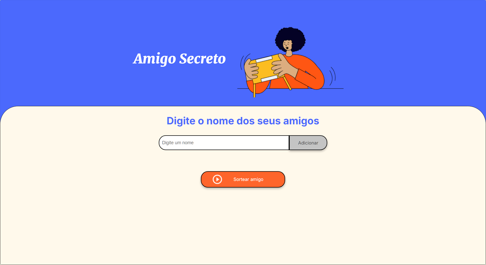
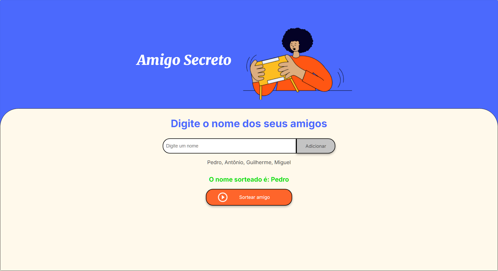

#  Amigo Secreto - Challenge Alura & Oracle Next Education 

##  Sobre o Desafio

Este projeto faz parte do curso **Oracle Next Education** e tem como objetivo desenvolver uma aplicação em JavaScript que permita aos usuários organizar um sorteio de **Amigo Secreto**. O usuário poderá adicionar nomes em uma lista e realizar um sorteio aleatório.

---

## Funcionalidades

- **Adicionar nomes**: O usuário pode inserir um nome em um campo de texto e adicioná-lo à lista ao clicar em "Adicionar".
- **Validação da entrada**: Se o campo estiver vazio, um alerta será exibido solicitando um nome válido.
- **Visualizar a lista**: Todos os nomes inseridos aparecerão em uma lista abaixo do campo de entrada.
- **Sorteio aleatório**: Ao clicar no botão "Sortear Amigo", um nome será selecionado aleatoriamente e exibido na tela.

---

## Tecnologia Utilizada

---

## Capturas de Tela

  

  

---

Projeto desenvolvido como parte do curso **Oracle Next Education**.
